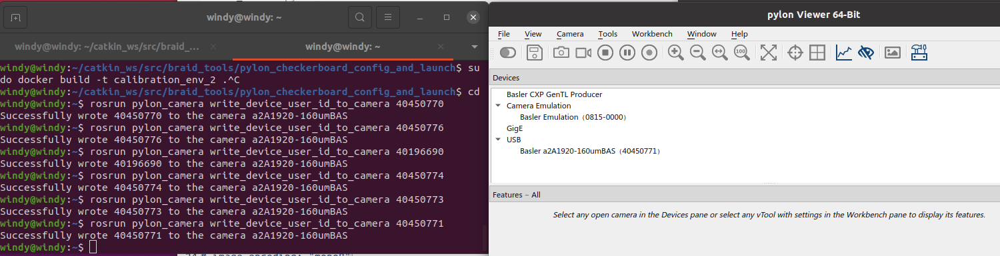
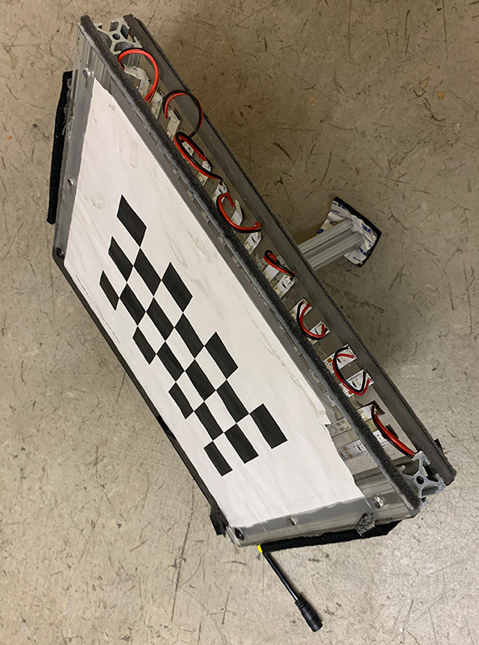
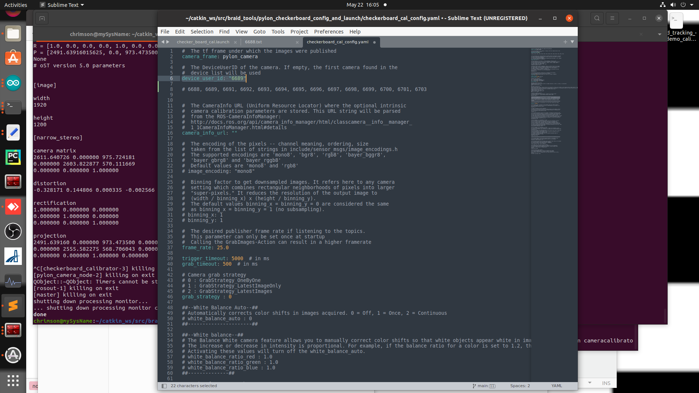
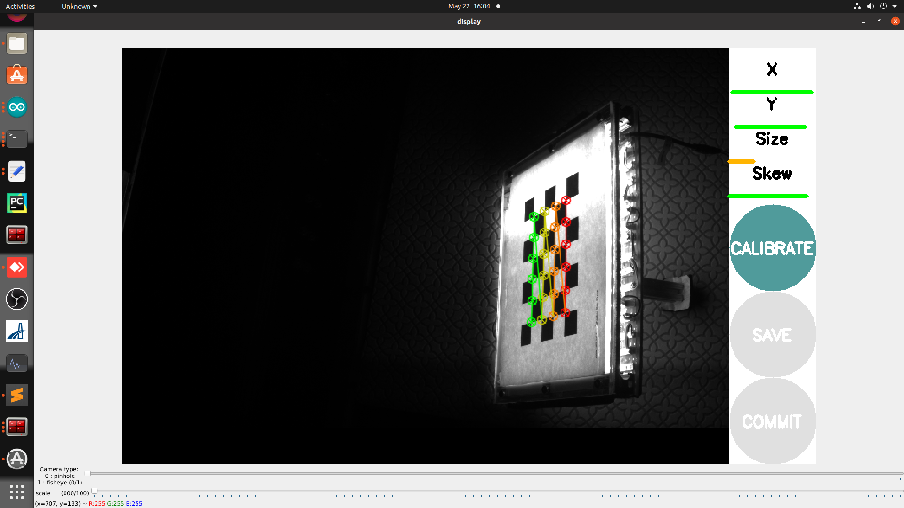
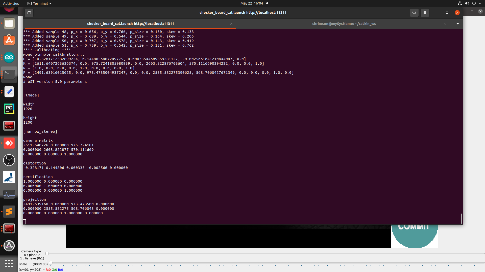

# Guide for performing a checkerboard calibration using ROS and applying to BRAID

For Basler USB 3 cameras running on ROS Noetic in Ubuntu 20. 

## Getting pylon ros camera running

##### Option 1: 

Install the ROS package pylon-ros-camera: [pylon-ros-camera](https://github.com/basler/pylon-ros-camera/tree/master)

Notes:
  * You have to use pylon 6.2 for it to compile
  * Use the master branch (eb4ca3f9afc23c9b7f6f2459c3ca62aefbb47185) for this to work in Ubuntu 20 with ROS Noetic
  * You can intall pylon 6.2, run catkin_make, and then reinstall pylon 7.3 for braid. I think you need to keep the directory for pylon 6.2 in /opt. Recommendation: install pylon 6.2, move /opt/pylon to /opt/pylon6, set PYLON_ROOT to /opt/pylon6, run catkin_make, move /opt/pylon6 to ~/ temporarily, install pylon 7.3, move ~/pylon6 back to /opt/pylon6.
  * See also: [ubuntu 20 install nodes](https://github.com/vanbreugel-lab/wind_tunnel_resources/blob/main/installation/ubuntu_20_noetic_install_notes.md)

##### Option 2: 

Install the old version of pylon_camera: [pylon_camera](https://github.com/florisvb/pylon_camera). This works with pylon 5.2, otherwise same concept as option 1. See also: [ubuntu 20 install nodes](https://github.com/vanbreugel-lab/wind_tunnel_resources/blob/main/installation/ubuntu_20_noetic_install_notes.md)

## Assign device IDs

This is useful and necessary to use ros pylon_camera when there are multiple cameras plugged in. One at a time plug in a USB camera, use pylon viewer to check the device serial number, then run the following command to set the device id. Then you can use this device id to specify which camera to launch with pylon_camera.

`rosrun pylon_camera write_device_user_id_to_camera 40450773`



## Have checkerboard calibrator on hand. 

We use a IR backlit printed sheet. 




## Run pylon_camera and ROS checkerboard for each camera

To make this easy you can use the `.yaml` and `.launch` files in the `pylon_checker_launch` directory. 
1. Edit `checkerboard_cal_config.yaml` so that the `device_user_id` matches the device id of the camera that you want to calibrate. See screen shot below.
2. If needed, edit `checkerboard_cal_config.yaml` so that the `exposure` gives you a good checkerboard image
3. Run the launch file: `roslaunch checker_board_cal.launch`. *NOTE*: you may need to edito the launch file to ensure that the number of checkers and size is correct! This launch file is hard coded for our checkerboard calibrator. 
4. Move the checkerboard around until the user interface shows green lines for x, y, and skew (and is possible size, but that does not always happen). Once you have enough data the calibrate button will be green. See screen shot below. 
5. Press calibrate.
6. Go to the terminal where you ran the launch file. It will (after some computation) print out all the relevant calibration data. Copy the text, starting at "mono pinhole calibration..." and paste it into a text file, and save it with the full device number (e.g. 40196688.txt). See screen shot below. 
7. Repeat for every device id. 
8. Once complete you should have a directory that looks a lot like the one in `test_data`


#### 1. Edit the `device_user_id` in `checkerboard_cal_config.yaml`


#### 4. Checkerboard GUI after collecting enough data


#### 6. Terminal print out


## Convert raw ROS text outputs to yaml files compatible with BRAID

Edit `convert_raw_ros_to_yaml.py`, in particular these lines:
```
    source_dir = 'test_data'
    dest_dir = 'test_data_yamls'
    camera_basename = 'Basler-'
```

Run the python script: `python convert_raw_ros_to_yaml.py`. It should create and populate the `dest_dir` with yaml files. You are now ready to use the checkerboard calibration files in BRAID. 
